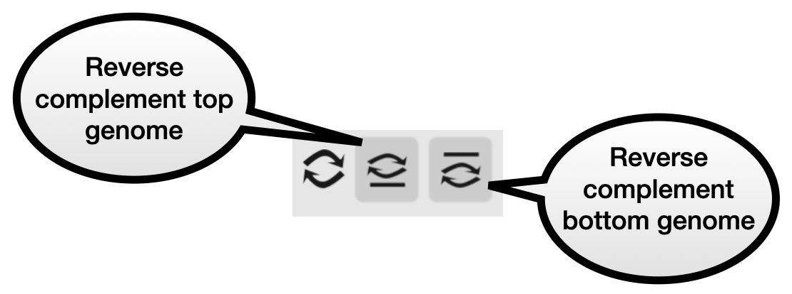

Contig editing
==============

TNA currently supports basic editing: contigs can be reverse complemented or
moved.

To reverse complement every contig in either genome, use the buttons in the left
panel.

Note: this could take a few seconds, because it has to process every
blast alignment (to the base-pair level), reversing them all.

Move or reverse complement a contig
-----------------------------------

Select a contig by left-clicking on it. You will see a message at the top
of the window similar to "Selected - contig: top genome / contig1".
At the bottom of the left panel, the contig options will appear.
There are buttons to move the contig, or reverse complement it.

.. image:: pics/tna_docs_contig_opts.png
   :width: 400
   :alt: screenshot showing contig options buttons
