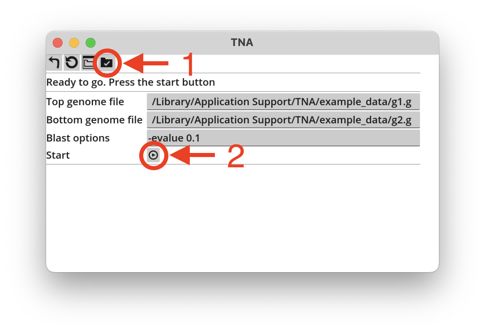
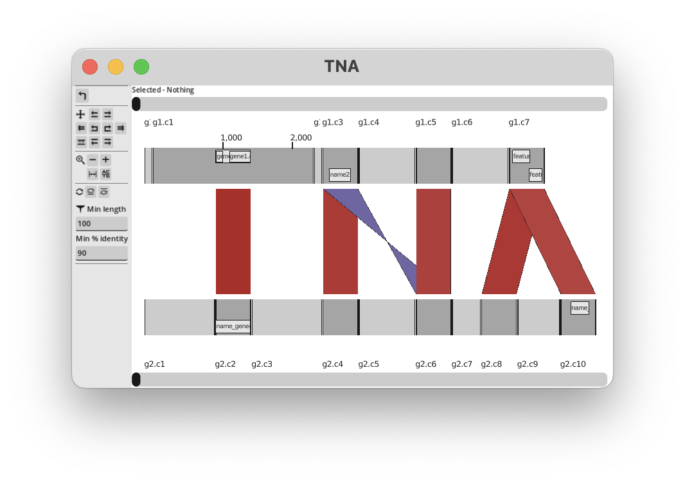

Installing TNA
==============

Supported Operating Systems
---------------------------

* Windows 11 (x86 only, no ARM support)
* macOS (tested on sequoia 15.1)
* Linux (tested on Ubuntu 20.04/x86, 22.04/x86, and 24.04/aarch64)

Download TNA
------------

Go to the `TNA release page <https://github.com/martinghunt/tna/releases>`_
and download the correct version for your computer:

* Windows 11 - ``tna.vX.Y.Z.windows.exe``
* macOS - ``tna.vX.Y.Z.mac.dmg``
* Linux x86_64/arm64 - ``tna.vX.Y.Z.linux.x86_64``/``tna.vX.Y.Z.linux.arm64``

The actual filenames have the release number in them instead of ``X.Y.Z``
in the above filenames.

Windows
^^^^^^^

Double-click on the downloaded file and it should just work.
You may find Windows Defender popping up, in which case you will need to
tell it to allow TNA to run.

macOS
^^^^^

Double-click the downloaded ``tna.mac.dmg`` file. It contains the app ``tna.app``.
Drag or copy it into your Applications folder (or wherever you like depending on
how you organise your files).

macOS Gatekeeper will probably block it from running. If this happens,
you have two options:

1. Go to "Privacy & Security" in the Settings app. Scroll to the bottom
   and TNA should be there for you to allow it
2. In a terminal, run this command:
   ``xattr -d com.apple.quarantine -r tna.app``.

Then TNA should just work. We apologise for the inconvenience, but this
process is standard for apps that have not been
`"notarized" by Apple <https://www.youtube.com/watch?v=X6HZlpPGFf0>`_ (which
means paying an annual fee).

Linux
^^^^^

You may need to make the downloaded binary file executable
(ie run ``chmod +x``). Then opening it in your file browser (or in
a terminal if you want to see logging) should just work.

First time running TNA
----------------------

The first time you run TNA, it will automatically download two extra programs:

1. ``tnahelper``. This is a separate command line program made for TNA, which
   handles bioinformatics tasks (the source code is here:
   https://github.com/martinghunt/tnahelper). Don't worry, you won't ever
   have to run it yourself - TNA uses it in the background.
2. NCBI-blast+. Specifically, TNA gets the programs ``makeblastdb`` and
   ``blastn``. These are part of a large download containing the full blast
   suite of programs, which is why the download is quite large.

This might take some time, depending on your internet speed.
You will see messages like:

.. code-block:: text

    tnahelper not found: /Users/username/Library/Application Support/tna/bin/tnahelper
    Downloading: https://github.com/martinghunt/tnahelper/releases/download/v0.3.2/tnahelper_darwin_arm64

and:

.. code-block:: text

    Some blast programs not found, or version unknown. Downloading...
    Running: /Users/username/Library/Application Support/tna/bin/tnahelper download_binaries --outdir /Users/username/Library/Application Support/tna/bin
    This may take some time, depending on internet bandwidth

The filenames you see will vary depending on your OS
(those examples are from macOS).

Next time TNA runs, it will find those programs, not need to download them,
and start up quickly.

Use the test data
-----------------

TNA has built-in test data. It is a good idea to try this out to check that
the installation is working correctly.

Press the "New" button. You should see the window below.

1. Click the "test data" icon (the rightmost icon on the top row, circled).
   This will fill in the top and bottom genome filenames with the names
   of the  test files.
2. Click the "start" button (circled at the bottom) to begin processing.

After pressing start, it will process the data.
This means importing the genome files,
running BLAST, and processing the output. If this all works successfully and
TNA displays the genomes and BLAST matches, then everything is working
as expected. It should look like this:

