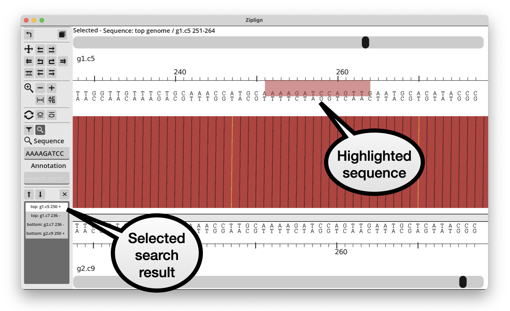
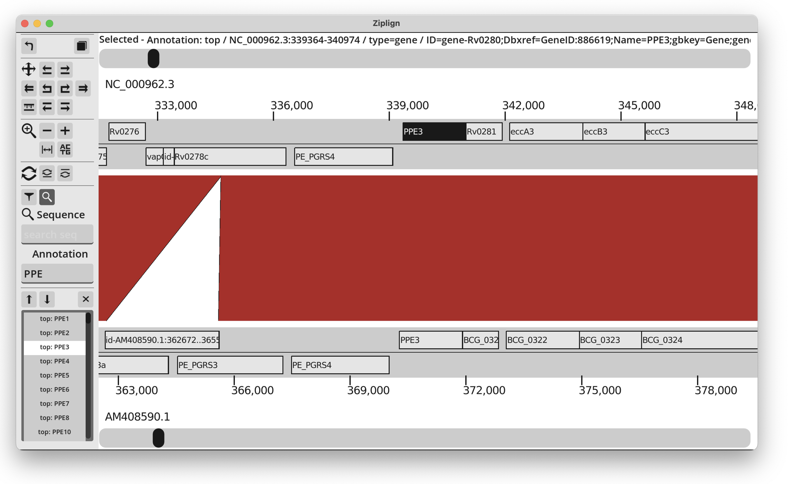

Searching
=========

The search panel can be opened by clicking the magnifying glass search
icon on the left.

.. image:: pics/zl_docs_search_panel.png
   :width: 100
   :alt: screenshot showing search panel

Search for sequence
-------------------

Search for a nucleotide sequence by putting it into the sequence search
box and pressing enter. This finds exact sequence matches on either the forward
or reverse strands of either genome, and is case-insensitive.
The matches will be listed in the panel
at the bottom. Click on a match to highlight it and jump so that it starts
in the middle of the screen. Use the up/down buttons to scroll through the
matches.

Sequence can be pasted into the search box in FASTA format. Ziplign will deal
with this by removing the header line. If multi-FASTA is pasted, only the
first record will be used and all other ones ignored. This means you can
highlight a region (see
:ref:`Selecting/copying a region <viewing:Selecting and copying a region>`), copy
it and then paste into the search box. But pasting into another application
will still paste the full FASTA format.

Search for annotation
---------------------

Search for annotation features by typing a search term into the annotation
search box and pressing enter. This will find all annotation features that
contain the search string anywhere in their metadata. It is a case-insensitive
search. For example, searching for "ppe" in the *M. tuberculosis* genome
will return all of the PPE genes: PPE1, PPE2, ... etc.

In the same way as sequence search, the results will be listed in the panel
at the bottom. Selecting one of the results will highlight that feature
and jump the view so that the feature starts in the middle of the screen.

