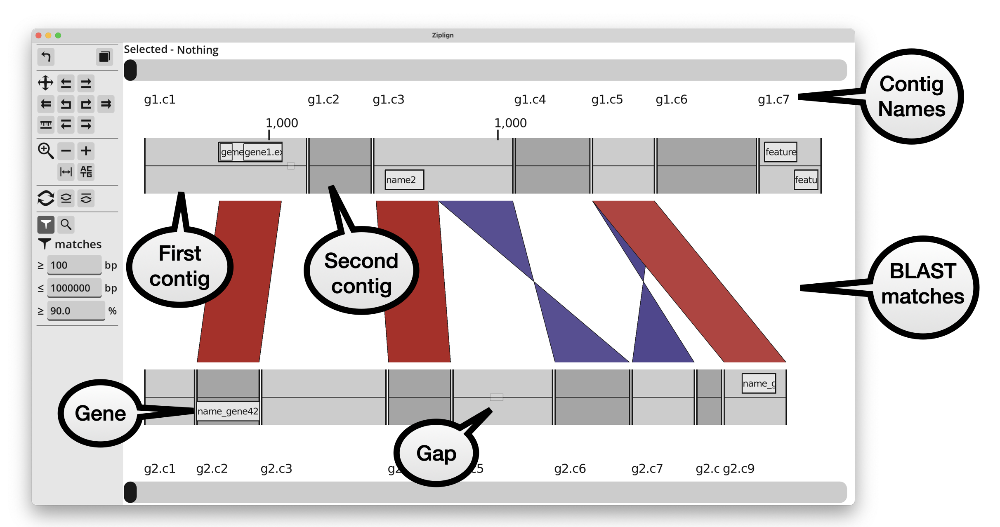
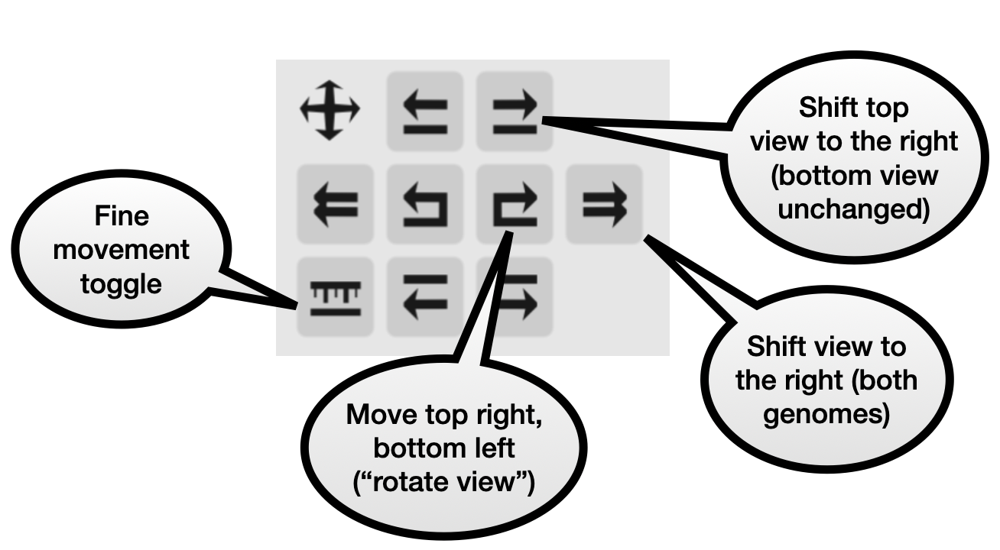
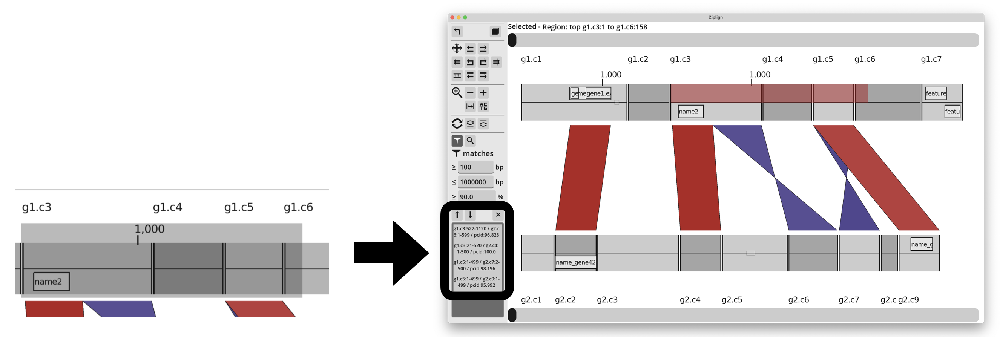

Viewing Genomes
===============

Default view
------------

The initial view is zoomed to show an overview of both genomes and the
BLAST matches between them.

Contigs
^^^^^^^

The contigs of each genome are shown in alternating colours, and annotation
features (eg genes) are shown inside them. Features on the forwards strand
(or with no strand annotated) are shown in the top half of the genome, and
those on the reverse strand are in the bottom half of the genome.

Names of contigs and contig coordinates are shown above the top genome,
and below the bottom genome.

BLAST matches
^^^^^^^^^^^^^

BLAST matches are show as parallelograms between the top and bottom genomes.
Matches on the same strand in each genome are red, and those on opposite
strands are blue (using the default colour scheme, otherwise the colours
may be different). Reverse matches are "twisted" into two triangles because
the match runs in opposing directions on each genome.
The colour of each match is scaled with the percent
identity, getting lighter the further away from an identity of 100%.

Left-clicking on a match will highlight it, and show its details
at the top of the window. It will say something like
"Selected - Match: top_contig_name:901-1400 / bottom_contig_name:1-500 / pcid:99.5".
In that example, the match is at position 901 to 1400 in the top contig,
1-500 in the bottom contig, with 99.5 percent identity.

Navigation
----------

There are several ways to pan and zoom around the genomes. There are
buttons in the left-hand panel, mouse/trackpad controls, and
:doc:`keyboard shortcuts </keyboard_shortcuts>`.

The scrollbars at the top and bottom are a simple way to slide the view
of either genome to the left or right.

Navigation panel
^^^^^^^^^^^^^^^^

These buttons let you shift the view of the top and/or bottom genome.
They allow for all combinations of moving either genome to the left or right.
By default one button press will move 50% of of the window width.
Turning on the "fine control" button makes each movement significantly
smaller.

Zoom panel
^^^^^^^^^^

.. image:: pics/zl_docs_zoom_buttons.png
   :width: 400
   :alt: explanation of navigation buttons

These buttons allow you to zoom in or out, reset the view, or zoom in
enough to see the sequence of each genome. Zooming in and out is centered
on the middle of the window.

Jump with double-clicking
^^^^^^^^^^^^^^^^^^^^^^^^^

Double-clicking at any point in a genome will shift its view so that the
position where you double-clicked is in the middle of the screen.

Double-clicking a BLAST match shifts the view so that the left of the match
is at the centre of the screen.

Mouse/trackpad gestures
^^^^^^^^^^^^^^^^^^^^^^^

You can zoom in and out using the mouse wheel, or using a pinch gesture
on a trackpad. The zoom is centered on the position of the mouse pointer.
On a Mac with magic mouse, sliding up/down will zoom.

You can scroll left/right (ie moving both top and bottom genomes) using a
swipe left/right gesture. This has only been tested on a Mac, which is
sliding two fingers left or right on the trackpad, or a single finger
sideways slide on a magic mouse.

The sensitivity of these can be adjusted in the
:doc:`settings </settings>`.

Base-pair view
--------------

Zooming in enough will show the contig sequences
on the forward and reverse strands. It also shows more detailed BLAST
alignments. Instead of just a solid block, it uses lines to show
each matching position between the genomes, and highlights SNPs. Indels
result in non-parallel lines.

.. image:: pics/zl_docs_basepair_view.png
   :width: 500
   :alt: screenshot of zoomed in view showing base pairs

This information is taken from the BLAST alignment output that you are
probably familiar with, which has this format:

.. code-block:: text

    AC--TGACGTACG
    ||  ||  ||*||
    ACTGTG--GTCCG

Filtering matches
-----------------

Matches that are shown can be filtered by minimum length or percent identity,
using the boxes in the left panel. If it is not already selected, press the
"filter" icon to show the filter options.

.. image:: pics/zl_docs_match_filter.png
   :width: 140
   :alt: screenshot of match filter controls

By default, only matches of length 100bp-1Mbp and at least 90% identity are
shown. The minimum values can be changed in the boxes. Note that showing all
matches may slow Ziplign down if there is a large number of them on screen.

If you are viewing a genome compared to itself, then you probably want to
set the maximum match length to be less than the length of the genome, so that
there is not one huge match filling in the whole window.

Matches in a region
-------------------

You can find all BLAST matches that lie in a particular region of
either genome.  On either genome, left-click and hold, then drag
to highlight a region. When the button is released, all matches that overlap the
highlighted region are listed in the bottom of the left hand panel.

Click on any of the matches listed on the left to jump to them in the main
viewing window. Or there are up and down arrows to scroll through them, making
it easy to jump to each match in turn. Pressing the "X" button
will close the list.

Selecting and copying a region
------------------------------

After dragging along any region of either genome with the left mouse
button, it remains highlighted and the coordinates are in the top where
it says "Selected = Region: ...". Dragging from left to right will select
the forwards strand, and from right to left selects the reverse strand.

The highlighted sequence can be copied to the clipboard using
ctrl-c (Windows/linux) or cmd-c (macOS), or by pressing the "copy" button
at the top.

.. image:: pics/zl_docs_copy_region.png
   :width: 300
   :alt: screenshots of making a list of matches

The sequence is copied in FASTA format and includes the sequence coordinates
in the FASTA header. It will be reverse complemented if the reverse strand
was highlighted. If the highlighted region spans more than one contig, then
it will be in multi-FASTA format.

Saving and loading positions
----------------------------

There are 9 slots for temporarily saving views. Pressing shift+1 saves
the current position (zoom level and genome positions) to slot 1.
Then pressing 1 will jump back to that saved position. This works
for the keys 1-9, giving 9 save slots.

Note that this is not remembered between sessions, and
if you
:doc:`move or reverse complement contigs </contig_editing>`
(described later), the saved
positions will not be aware of it. They will just jump to the position
as defined by where the top/bottom scrollbars were and set the zoom level.

